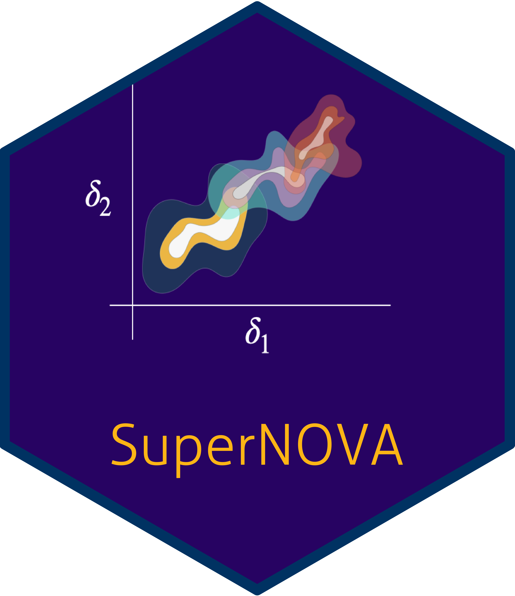

<!-- README.md is generated from README.Rmd. Please edit that file -->

# R/`SuperNOVA` 

<!-- badges: start -->

[](https://github.com/blind-contours/SuperNOVA/actions)
[](https://codecov.io/github/blind-contours/SuperNOVA?branch=master)
[](https://www.r-pkg.org/pkg/SuperNOVA)
[](https://CRAN.R-project.org/package=SuperNOVA)
[](https://CRAN.R-project.org/package=SuperNOVA)
[](https://www.repostatus.org/#active)
[](https://opensource.org/licenses/MIT)
<!-- [](https://doi.org/10.5281/zenodo.4070042) -->
<!-- [](https://doi.org/10.21105/joss.02447) -->
<!-- badges: end -->

> Efficient Estimation of the Causal Effects of Non-Parametric
> Interactions and Effect Modifications using Stochastic Interventions
> **Authors:** [David McCoy](https://davidmccoy.org)

------------------------------------------------------------------------

## What’s `SuperNOVA`?

The `SuperNOVA` R package is designed to provide facilities to
data-adaptively identify variable sets that are most predictive of an
outcome of interest and construct efficient estimators for the
counterfactual mean of an outcome under stochastic interventions on
these variables. Stochastic interventions are shifts to the exposures
that depend on the naturally observed values (Dı́az and van der Laan
2012; Haneuse and Rotnitzky 2013). `SuperNOVA` builds off of the
`txshift` package which implements the targeted maximum likelihood (TML)
estimator of a stochastic shift causal parameter originally proposed by
Dı́az and van der Laan (2018). `SuperNOVA` extends the original
stochastic intervention methodology from one treatment/exposure variable
to include joint stochastic interventions on two variables which allows
for the construction of a non-parametric interaction parameter.
Likewise, `SuperNOVA` also estimates both individual stochastic
intervention outcomes under some delta shift compared to outcome under
no intervention and a target parameter for effect modification which is
the difference in mean outcomes under intervention compared to no
intervention across strata of an effect modifier.

Of course, it is not known a priori in most cases what variables are
interacting or modifying effects and therefore it is necessary to
identify these variable sets first. As such `SuperNOVA` uses V-fold
cross-validation framework to estimate a data-adaptive parameter in
training folds and a non-parametric interaction target parameter in
estimation folds. Our data-adaptive parameters are variable sets used in
basis functions in the best fitting multivariate adaptive regression
spline model. The best fitting model is determined using a Super Learner
which selects the model from an ensemble with the lowest cross-validated
MSE. Variable sets are considered important based on ANOVA-like variance
decompositions for the basis functions in the best fitting model.
Individual variables and variable sets used in all the training folds
are considered consistent predictors. The interaction target parameter
is applied to variable sets composed of two variables in the mixed
exposure. This target parameter is the expected outcome under a dual
shift of both variables by some delta compared to the sum of individual
shifts. Other parameters exist for effect modification and individual
variable shifts. Cross-validated targeted minimum loss-based estimation
(TMLE) is used to update the initial expected outcomes given stochastic
shift interventions. This method, called SuperNOVA, guarantees
consistency, efficiency, and multiple robustness. SuperNOVA provides
researchers with V-fold specific and pooled results for each target
parameter. Additional information is provided in the vignette.

`SuperNOVA` integrates with the [`sl3`
package](https://github.com/tlverse/sl3) (Coyle et al. 2022) to allow
for ensemble machine learning to be leveraged in the estimation
procedure for each nuisance parameter and estimation of the
data-adaptive parameters in the iterative backfitting procedure used to
identify basis functions in the best fittin model. There are several
stacks of machine learning algorithms used that are constructed from
`sl3`.

------------------------------------------------------------------------

## Installation

For standard use, we recommend installing the package from
[CRAN](https://CRAN.R-project.org/package=SuperNOVA) via

``` r
install.packages("SuperNOVA")
```

*Note:* If `SuperNOVA` is installed from
[CRAN](https://CRAN.R-project.org/package=SuperNOVA), the `sl3`, an
enhancing dependency that allows ensemble machine learning to be used
for nuisance parameter estimation, won’t be included. We highly
recommend additionally  
installing `sl3` from GitHub via
[`remotes`](https://CRAN.R-project.org/package=remotes):

``` r
remotes::install_github("tlverse/sl3@devel")
```

For the latest features, install the most recent *stable version* of
`SuperNOVA` from GitHub via
[`remotes`](https://CRAN.R-project.org/package=remotes):

``` r
remotes::install_github("blind-contours/SuperNOVA@main")
```

To contribute, install the *development version* of `SuperNOVA` from
GitHub via [`remotes`](https://CRAN.R-project.org/package=remotes):

``` r
remotes::install_github("blind-contours/SuperNOVA@devel")
```

------------------------------------------------------------------------

## Example

To illustrate how `SuperNOVA` may be used to ascertain the effect of a
mixed exposure, consider the following example:

``` r
library(SuperNOVA)
library(devtools)
#> Loading required package: usethis
library(kableExtra)

load_all('~/sl3')
#> ℹ Loading sl3
set.seed(429153)
# simulate simple data
n_obs <- 400
```

The `simulate_data` function creates simulated data with a multivariate
exposure, covariates (confounders), and a continuous outcome.

``` r
data_info <- simulate_data(n_obs = n_obs)
data <- data_info$data
head(data) %>%
  kbl(caption = "Simulated Data") %>%
  kable_classic(full_width = F, html_font = "Cambria")
```

<table class=" lightable-classic" style="font-family: Cambria; width: auto !important; margin-left: auto; margin-right: auto;">
<caption>
Simulated Data
</caption>
<thead>
<tr>
<th style="text-align:right;">
M1
</th>
<th style="text-align:right;">
M2
</th>
<th style="text-align:right;">
M3
</th>
<th style="text-align:right;">
W1
</th>
<th style="text-align:right;">
W2
</th>
<th style="text-align:right;">
W3
</th>
<th style="text-align:right;">
Y
</th>
</tr>
</thead>
<tbody>
<tr>
<td style="text-align:right;">
1.8118767
</td>
<td style="text-align:right;">
0.5594007
</td>
<td style="text-align:right;">
3.452442
</td>
<td style="text-align:right;">
1.703221
</td>
<td style="text-align:right;">
5.791806
</td>
<td style="text-align:right;">
6.853421
</td>
<td style="text-align:right;">
4.136139
</td>
</tr>
<tr>
<td style="text-align:right;">
1.3757667
</td>
<td style="text-align:right;">
3.1725122
</td>
<td style="text-align:right;">
3.442254
</td>
<td style="text-align:right;">
2.514812
</td>
<td style="text-align:right;">
7.733235
</td>
<td style="text-align:right;">
9.027789
</td>
<td style="text-align:right;">
5.392453
</td>
</tr>
<tr>
<td style="text-align:right;">
0.5968083
</td>
<td style="text-align:right;">
2.0818659
</td>
<td style="text-align:right;">
3.237153
</td>
<td style="text-align:right;">
1.895140
</td>
<td style="text-align:right;">
5.733427
</td>
<td style="text-align:right;">
5.480610
</td>
<td style="text-align:right;">
3.581071
</td>
</tr>
<tr>
<td style="text-align:right;">
2.6877639
</td>
<td style="text-align:right;">
1.6314774
</td>
<td style="text-align:right;">
3.201915
</td>
<td style="text-align:right;">
1.981383
</td>
<td style="text-align:right;">
7.167639
</td>
<td style="text-align:right;">
6.774952
</td>
<td style="text-align:right;">
4.511434
</td>
</tr>
<tr>
<td style="text-align:right;">
3.0809005
</td>
<td style="text-align:right;">
2.8610332
</td>
<td style="text-align:right;">
3.951894
</td>
<td style="text-align:right;">
1.958279
</td>
<td style="text-align:right;">
7.250296
</td>
<td style="text-align:right;">
7.569938
</td>
<td style="text-align:right;">
4.829608
</td>
</tr>
<tr>
<td style="text-align:right;">
0.8583468
</td>
<td style="text-align:right;">
0.8110409
</td>
<td style="text-align:right;">
3.091384
</td>
<td style="text-align:right;">
2.018843
</td>
<td style="text-align:right;">
6.941566
</td>
<td style="text-align:right;">
8.299335
</td>
<td style="text-align:right;">
4.675133
</td>
</tr>
</tbody>
</table>

``` r
## this is the stack of learners to learn the density of our exposures, or the g mechanism
sl_density_lrnr <- make_density_superlearner()

# this stack will be used to find basis functions in the mixture during an iterative backfitting procedure, details in vignette
Lrnr_earth_1 <- Lrnr_earth$new(linpreds = FALSE, degree = 1)
Lrnr_earth_2 <- Lrnr_earth$new(linpreds = FALSE, degree = 2)
Lrnr_earth_3 <- Lrnr_earth$new(linpreds = FALSE, degree = 2, pmethod = "none")

learners <- c(
  Lrnr_earth_1,
  Lrnr_earth_2,
  Lrnr_earth_3
)

names(learners) <- c(
  "full earth 1",
  "full earth 2",
  "full earth 3"
)

Exposures_stack <- make_learner(Stack, learners)

## this is the stack of learners used to estimate Y given covariates in the iterative backfitting procedure

Lrnr_glm_basic <- Lrnr_glm$new()
Lrnr_mean_base <- Lrnr_mean$new()

Lrnr_ridge <- Lrnr_glmnet$new(alpha = 0)
Lrnr_lasso <- Lrnr_glmnet$new(alpha = 1)

learners <- c(
  Lrnr_earth_1,
  Lrnr_earth_2,
  Lrnr_earth_3,
  Lrnr_glm_basic,
  Lrnr_mean_base,
  Lrnr_ridge,
  Lrnr_lasso
)

names(learners) <- c(
  "full earth 1",
  "full earth 2",
  "full earth 3",
  "Lrnr_glm",
  "Lrnr_mean",
  "Lrnr_ridge",
  "Lrnr_lasso"
)

Covariate_stack <- make_learner(Stack, learners)

## and now we make the estimators for our Q or outcome mechanism: 

mean_lrnr <- Lrnr_mean$new()
fglm_lrnr <- Lrnr_glm_fast$new()
rf_lrnr <- Lrnr_ranger$new()
lasso_learner <- Lrnr_glmnet$new(alpha = 1)
ridge_learner <- Lrnr_glmnet$new(alpha = 0)
lrn_polspline <- Lrnr_polspline$new()
lrn_ranger100 <- make_learner(Lrnr_ranger, num.trees = 100)
hal_lrnr <- Lrnr_hal9001$new(max_degree = 3, n_folds = 3)

Outcome_stack <- make_learner(
  Stack, mean_lrnr, fglm_lrnr, rf_lrnr, lasso_learner, ridge_learner, lrn_polspline, lrn_ranger100, Lrnr_earth_1, Lrnr_earth_2, Lrnr_earth_3
)
```

``` r
W <- data[, c("W2", "W3")]
A <- data[, c("M1", "M2", "M3")]
V <- data[, c("W1")]
Y <- data[, c("Y")]


sim_results <- SuperNOVA(W = W,
                         V = V,
                         A = A,
                         Y = Y,
                         delta = 1,
                         LOD_val = 0,
                         Density_stack = sl_density_lrnr,
                         Exposures_stack = Exposures_stack,
                         Covariate_stack = Covariate_stack,
                         Outcome_stack = Outcome_stack,
                         n_folds = 3,
                         family = "continuous",
                         quantile_thresh = 0) 

indiv_shift_results <- sim_results$`Indiv Shift Results`
em_results <- sim_results$`Effect Mod Results`
joint_shift_results <- sim_results$`Joint Shift Results`
```

Let’s first look at the results for individual stochastic shifts by
delta compared to no shift:

``` r
indiv_shift_results %>%
  kbl(caption = "Individual Stochastic Intervention Results") %>%
  kable_classic(full_width = F, html_font = "Cambria")
```

<table class=" lightable-classic" style="font-family: Cambria; width: auto !important; margin-left: auto; margin-right: auto;">
<caption>
Individual Stochastic Intervention Results
</caption>
<thead>
<tr>
<th style="text-align:left;">
Condition
</th>
<th style="text-align:right;">
Psi
</th>
<th style="text-align:right;">
Variance
</th>
<th style="text-align:right;">
SE
</th>
<th style="text-align:right;">
Lower CI
</th>
<th style="text-align:right;">
Upper CI
</th>
<th style="text-align:right;">
P-value
</th>
<th style="text-align:right;">
Fold
</th>
<th style="text-align:left;">
Type
</th>
<th style="text-align:left;">
Variables
</th>
<th style="text-align:right;">
N
</th>
</tr>
</thead>
<tbody>
<tr>
<td style="text-align:left;">
M1
</td>
<td style="text-align:right;">
0.1876427
</td>
<td style="text-align:right;">
0.0001834
</td>
<td style="text-align:right;">
0.0135413
</td>
<td style="text-align:right;">
0.1611
</td>
<td style="text-align:right;">
0.2142
</td>
<td style="text-align:right;">
0.0000000
</td>
<td style="text-align:right;">
1
</td>
<td style="text-align:left;">
Indiv Shift
</td>
<td style="text-align:left;">
M1
</td>
<td style="text-align:right;">
134
</td>
</tr>
<tr>
<td style="text-align:left;">
V
</td>
<td style="text-align:right;">
0.3414451
</td>
<td style="text-align:right;">
0.0000547
</td>
<td style="text-align:right;">
0.0073931
</td>
<td style="text-align:right;">
0.3270
</td>
<td style="text-align:right;">
0.3559
</td>
<td style="text-align:right;">
0.0000000
</td>
<td style="text-align:right;">
1
</td>
<td style="text-align:left;">
Indiv Shift
</td>
<td style="text-align:left;">
V
</td>
<td style="text-align:right;">
134
</td>
</tr>
<tr>
<td style="text-align:left;">
M1
</td>
<td style="text-align:right;">
0.3930172
</td>
<td style="text-align:right;">
0.0009406
</td>
<td style="text-align:right;">
0.0306698
</td>
<td style="text-align:right;">
0.3329
</td>
<td style="text-align:right;">
0.4531
</td>
<td style="text-align:right;">
0.0000000
</td>
<td style="text-align:right;">
2
</td>
<td style="text-align:left;">
Indiv Shift
</td>
<td style="text-align:left;">
M1
</td>
<td style="text-align:right;">
133
</td>
</tr>
<tr>
<td style="text-align:left;">
V
</td>
<td style="text-align:right;">
0.7022562
</td>
<td style="text-align:right;">
0.0019023
</td>
<td style="text-align:right;">
0.0436153
</td>
<td style="text-align:right;">
0.6168
</td>
<td style="text-align:right;">
0.7877
</td>
<td style="text-align:right;">
0.0000000
</td>
<td style="text-align:right;">
2
</td>
<td style="text-align:left;">
Indiv Shift
</td>
<td style="text-align:left;">
V
</td>
<td style="text-align:right;">
133
</td>
</tr>
<tr>
<td style="text-align:left;">
M1
</td>
<td style="text-align:right;">
-0.1832273
</td>
<td style="text-align:right;">
0.0054946
</td>
<td style="text-align:right;">
0.0741256
</td>
<td style="text-align:right;">
-0.3285
</td>
<td style="text-align:right;">
-0.0379
</td>
<td style="text-align:right;">
0.0134416
</td>
<td style="text-align:right;">
3
</td>
<td style="text-align:left;">
Indiv Shift
</td>
<td style="text-align:left;">
M1
</td>
<td style="text-align:right;">
133
</td>
</tr>
<tr>
<td style="text-align:left;">
V
</td>
<td style="text-align:right;">
-0.3607981
</td>
<td style="text-align:right;">
0.0147294
</td>
<td style="text-align:right;">
0.1213649
</td>
<td style="text-align:right;">
-0.5987
</td>
<td style="text-align:right;">
-0.1229
</td>
<td style="text-align:right;">
0.0029506
</td>
<td style="text-align:right;">
3
</td>
<td style="text-align:left;">
Indiv Shift
</td>
<td style="text-align:left;">
V
</td>
<td style="text-align:right;">
133
</td>
</tr>
</tbody>
</table>

Next we can look at effect modifications:

``` r
em_results %>%
  kbl(caption = "Effect Modification Stochastic Intervention Results") %>%
  kable_classic(full_width = F, html_font = "Cambria")
```

<table class=" lightable-classic" style="font-family: Cambria; width: auto !important; margin-left: auto; margin-right: auto;">
<caption>
Effect Modification Stochastic Intervention Results
</caption>
<thead>
<tr>
<th style="text-align:left;">
x
</th>
</tr>
</thead>
<tbody>
<tr>
<td style="text-align:left;">
NA
</td>
</tr>
</tbody>
</table>

And finally results for the joint shift

``` r
joint_shift_results %>%
  kbl(caption = "Interactions Stochastic Intervention Results") %>%
  kable_classic(full_width = F, html_font = "Cambria")
```

<table class=" lightable-classic" style="font-family: Cambria; width: auto !important; margin-left: auto; margin-right: auto;">
<caption>
Interactions Stochastic Intervention Results
</caption>
<thead>
<tr>
<th style="text-align:left;">
x
</th>
</tr>
</thead>
<tbody>
<tr>
<td style="text-align:left;">
NA
</td>
</tr>
</tbody>
</table>

    ---

    ## Issues

    If you encounter any bugs or have any specific feature requests, please [file an
    issue](https://github.com/blind-contours/SuperNOVA/issues). Further details on filing
    issues are provided in our [contribution
    guidelines](https://github.com/blind-contours/SuperNOVA/blob/master/CONTRIBUTING.md).

    ---

    ## Contributions

    Contributions are very welcome. Interested contributors should consult our
    [contribution
    guidelines](https://github.com/blind-contours/SuperNOVA/blob/master/CONTRIBUTING.md)
    prior to submitting a pull request.

    ---

    ## Citation

    After using the `SuperNOVA` R package, please cite the following:


    ---

    ## Related

    * [R/`tmle3shift`](https://github.com/tlverse/tmle3shift) - An R package
      providing an independent implementation of the same core routines for the TML
      estimation procedure and statistical methodology as is made available here,
      through reliance on a unified interface for Targeted Learning provided by the
      [`tmle3`](https://github.com/tlverse/tmle3) engine of the [`tlverse`
      ecosystem](https://github.com/tlverse).

    * [R/`medshift`](https://github.com/nhejazi/medshift) - An R package providing
      facilities to estimate the causal effect of stochastic treatment regimes in
      the mediation setting, including classical (IPW) and augmented double robust
      (one-step) estimators. This is an implementation of the methodology explored
      by @diaz2020causal.

    * [R/`haldensify`](https://github.com/nhejazi/haldensify) - A minimal package
      for estimating the conditional density treatment mechanism component of this
      parameter based on using the [highly adaptive
      lasso](https://github.com/tlverse/hal9001) [@coyle-hal9001-rpkg;
      @hejazi2020hal9001-joss] in combination with a pooled hazard regression. This
      package implements a variant of the approach advocated by @diaz2011super.

    ---

    ## Funding

    The development of this software was supported in part through grants from the


    ---

    ## License

    &copy; 2020-2022 [David B. McCoy](https://davidmccoy.org)

    The contents of this repository are distributed under the MIT license. See below
    for details:

MIT License Copyright (c) 2020-2022 David B. McCoy Permission is hereby
granted, free of charge, to any person obtaining a copy of this software
and associated documentation files (the “Software”), to deal in the
Software without restriction, including without limitation the rights to
use, copy, modify, merge, publish, distribute, sublicense, and/or sell
copies of the Software, and to permit persons to whom the Software is
furnished to do so, subject to the following conditions: The above
copyright notice and this permission notice shall be included in all
copies or substantial portions of the Software. THE SOFTWARE IS PROVIDED
“AS IS,” WITHOUT WARRANTY OF ANY KIND, EXPRESS OR IMPLIED, INCLUDING BUT
NOT LIMITED TO THE WARRANTIES OF MERCHANTABILITY, FITNESS FOR A
PARTICULAR PURPOSE AND NONINFRINGEMENT. IN NO EVENT SHALL THE AUTHORS OR
COPYRIGHT HOLDERS BE LIABLE FOR ANY CLAIM, DAMAGES OR OTHER LIABILITY,
WHETHER IN AN ACTION OF CONTRACT, TORT OR OTHERWISE, ARISING FROM, OUT
OF OR IN CONNECTION WITH THE SOFTWARE OR THE USE OR OTHER DEALINGS IN
THE SOFTWARE. \`\`\`

------------------------------------------------------------------------

## References

<div id="refs" class="references csl-bib-body hanging-indent">

<div id="ref-coyle-sl3-rpkg" class="csl-entry">

Coyle, Jeremy R, Nima S Hejazi, Ivana Malenica, Rachael V Phillips, and
Oleg Sofrygin. 2022. *<span class="nocase">sl3</span>: Modern Machine
Learning Pipelines for Super Learning*.
<https://doi.org/10.5281/zenodo.1342293>.

</div>

<div id="ref-diaz2012population" class="csl-entry">

Dı́az, Iván, and Mark J van der Laan. 2012. “Population Intervention
Causal Effects Based on Stochastic Interventions.” *Biometrics* 68 (2):
541–49.

</div>

<div id="ref-diaz2018stochastic" class="csl-entry">

———. 2018. “Stochastic Treatment Regimes.” In *Targeted Learning in Data
Science: Causal Inference for Complex Longitudinal Studies*, 167–80.
Springer Science & Business Media.

</div>

<div id="ref-haneuse2013estimation" class="csl-entry">

Haneuse, Sebastian, and Andrea Rotnitzky. 2013. “Estimation of the
Effect of Interventions That Modify the Received Treatment.” *Statistics
in Medicine* 32 (30): 5260–77.

</div>

</div>
